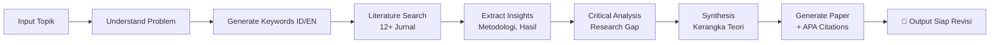

# **AI-Agentku As Student**
## *JARVIS + ResearchGPT — Asisten AI Cerdas dengan Kemampuan Riset Akademik Mendalam*

---

<p align="center">
  
  
  
  
</p>

<p align="center">
  <b>Asisten AI lengkap berbasis Gemini</b> yang menggabungkan asisten suara bergaya JARVIS dengan sistem riset akademik mendalam (ResearchGPT) — solusi all-in-one untuk produktivitas dan penelitian.
</p>

---

## 🌟 **Mengapa AI-agentku?**

| **🔍 Masalah** | **✅ Solusi Kami** |
|----------------|-------------------|
| Riset akademik butuh waktu berjam-jam | **ResearchGPT** hasilkan paper siap revisi dalam 2 menit |
| Harus install banyak tools berbeda | **All-in-one**: riset, musik, presentasi, pencarian |
| Bingung mulai riset dari mana | Analisis otomatis + 12+ referensi jurnal internasional |
| Format sitasi repot | **APA 7th Edition** otomatis di daftar pustaka |

---

## ✨ **Fitur Premium**

<table>
  <tr>
    <td width="50%" valign="top">
      <h3>🎓 <b>ResearchGPT — Deep Academic Research</b></h3>
      <ul>
        <li>✅ <b>Deep Research</b> — Analisis topik mendalam dengan keyword generation</li>
        <li>✅ <b>Literature Review</b> — Cari 12+ jurnal dari Scopus, IEEE, Springer</li>
        <li>✅ <b>Paper Generator</b> — Draft jurnal ilmiah siap revisi + sitasi APA</li>
        <li>✅ <b>Research Gap Analysis</b> — Identifikasi celah penelitian & trend</li>
        <li>✅ <b>Tabel Perbandingan</b> — Metodologi, hasil, kelebihan/kekurangan jurnal</li>
      </ul>
    </td>
    <td width="50%" valign="top">
      <h3>🎙️ <b>JARVIS — Asisten Suara Premium</b></h3>
      <ul>
        <li>✅ <b>Multi-Voice TTS</b> — Pilih suara cowok/cewek (Google TTS + lokal)</li>
        <li>✅ <b>Spotify Controller</b> — Play, pause, next, previous dengan suara</li>
        <li>✅ <b>PowerPoint Assistant</b> — Navigasi slideshow hands-free</li>
        <li>✅ <b>Wolfram Alpha</b> — Hitung rumus matematika & sains kompleks</li>
        <li>✅ <b>Quick Access</b> — Buka website favorit: YouTube, Gmail, GitHub, dll</li>
      </ul>
    </td>
  </tr>
</table>

---

## 🎯 **Demo Perintah**

```bash
# Research Mode
🎓 "riset machine learning dalam diagnosis covid-19"
🎓 "buat jurnal tentang blockchain di supply chain"
🎓 "buat paper artificial intelligence di pendidikan"

# Productivity Mode
🎵 "play bohemian rhapsody"
📊 "jarvis mulai"  → mulai slideshow PowerPoint
🌐 "buka youtube"  → langsung terbuka di browser

# Information Mode
📚 "apa itu large language model"
🧮 "hitung integral x^2 dx dari 0 sampai 5"
```

---

## 🚀 **Quick Start (60 Detik)**

### **1. Clone & Setup**
```bash
# Clone repository
git clone https://github.com/faiz-jihad/AI-agentku.git
cd AI-agentku

# Setup environment
python -m venv venv
source venv/bin/activate  # Windows: venv\Scripts\activate
pip install -r requirements.txt
```

### **2. Konfigurasi API**
```bash
cp .env.example .env
# Edit .env dengan API key kamu
```

### **3. Jalankan!**
```bash
# Mode ResearchGPT (Standalone)
python run_research.py "transformers dalam NLP"

# Mode JARVIS (Asisten Suara Lengkap)
python gemini.py
```

---

## 📊 **Perbandingan Fitur**

| **Fitur** | **AI-agentku** | **ChatGPT** | **Google Assistant** | **Siri** |
|-----------|:--------------:|:-----------:|:--------------------:|:--------:|
| **Research Paper Generator** | ✅ | ❌ | ❌ | ❌ |
| **APA Citation Otomatis** | ✅ | ⚠️ Manual | ❌ | ❌ |
| **Kontrol Spotify** | ✅ | ❌ | ✅ Terbatas | ✅ Terbatas |
| **Kontrol PowerPoint** | ✅ | ❌ | ❌ | ❌ |
| **Wolfram Alpha Integration** | ✅ | ⚠️ Plugin | ✅ | ⚠️ Terbatas |
| **Multi-Voice TTS** | ✅ | ⚠️ Terbatas | ✅ | ✅ |
| **Wikipedia Search** | ✅ | ⚠️ | ✅ | ✅ |
| **100% Gratis** | ✅ | ⚠️ | ✅ | ✅ |

---

## 📁 **Struktur Proyek**

```
📦 AI-agentku/
├── 📄 gemini.py              # 🎙️ JARVIS Main — Asisten Suara
├── 📄 research_gpt.py        # 🎓 ResearchGPT Core Engine
├── 📄 run_research.py        # 🚀 Entry Point Research Standalone
├── 📄 .env.example           # 🔑 Template API Keys
├── 📄 requirements.txt       # 📦 Dependencies
├── 📁 hasil_riset/           # 📚 Output Paper Otomatis
│   ├── 📄 riset_[topik].md
│   └── 📄 riset_[topik].txt
└── 📁 venv/                  # 🐍 Virtual Environment
```

---

## 🧠 **ResearchGPT Workflow**



---

## 🎤 **Daftar Perintah Lengkap**

<details>
<summary><b>📋 Klik untuk lihat semua perintah</b></summary>

### **🎓 Research & Akademik**
| Perintah | Fungsi |
|----------|--------|
| `riset [topik]` | Riset mendalam + generate paper |
| `buat jurnal [topik]` | Buat paper jurnal ilmiah |
| `buat paper [topik]` | Paper akademik siap revisi |

### **🎵 Spotify Control**
| Perintah | Fungsi |
|----------|--------|
| `buka spotify` | Buka aplikasi Spotify |
| `play [lagu]` | Putar lagu tertentu |
| `pause` / `resume` | Jeda / lanjutkan lagu |
| `next` / `previous` | Lagu berikutnya / sebelumnya |

### **📊 PowerPoint Assistant**
| Perintah | Fungsi |
|----------|--------|
| `jarvis konek` | Hubungkan ke PowerPoint |
| `jarvis mulai` | Mulai slideshow |
| `jarvis maju` | Slide berikutnya |
| `jarvis mundur` | Slide sebelumnya |
| `jarvis akhiri` | Akhiri slideshow |

### **🎤 Voice Settings**
| Perintah | Fungsi |
|----------|--------|
| `suara cowok` | Ganti ke suara pria (lokal) |
| `suara cewek` | Ganti ke suara wanita (Google TTS) |

### **🌐 Website Shortcuts**
| Perintah | Website |
|----------|---------|
| `buka youtube` | YouTube.com |
| `buka google` | Google.com |
| `buka gmail` | Gmail.com |
| `buka instagram` | Instagram.com |
| `buka github` | GitHub.com |

### **📚 Lain-lain**
| Perintah | Fungsi |
|----------|--------|
| `apa itu [topik]` | Cari di Wikipedia |
| `jam berapa` | Cek waktu sekarang |
| `hitung [rumus]` | Kalkulator via Wolfram Alpha |
| `bye` / `exit` / `keluar` | Keluar dari program |

</details>

---

## 🔧 **Requirements**

```
python >= 3.9
google-genai              # Gemini AI integration
python-dotenv             # Environment variables
pyttsx3                   # Local TTS (suara cowok)
gtts                      # Google TTS (suara cewek)
pygame                    # Audio playback
SpeechRecognition         # Voice recognition
pyaudio                   # Microphone input
wolframalpha              # Matematika & sains
wikipedia-api             # Wikipedia search
keyboard                  # Keyboard shortcuts
pywin32                   # Windows integration
requests                  # HTTP requests
```

---

## 🔒 **Security Best Practices**

- ✅ **.env** sudah di .gitignore — aman dari commit tidak sengaja
- ✅ API keys disimpan terpisah dari kode
- ✅ Gunakan `.env.example` sebagai template untuk kontributor
- ✅ Virtual environment — isolasi dependency

---

## 🤝 **Cara Berkontribusi**

Kami sangat terbuka untuk kontribusi! Berikut caranya:

1. **Fork** repository ini
2. **Clone** hasil fork: `git clone https://github.com/username/AI-agentku.git`
3. **Buat branch baru**: `git checkout -b fitur-keren`
4. **Commit perubahan**: `git commit -m 'Tambah fitur X'`
5. **Push ke branch**: `git push origin fitur-keren`
6. **Buat Pull Request** di GitHub

**Ide kontribusi:**
- Tambah dukungan bahasa lain
- Integrasi dengan Notion / Google Docs
- Fitur export PDF untuk paper
- Dukungan macOS/Linux lebih lanjut

---

## 📞 **Support & Contact**

- **Author**: Faiz Jihad
- **GitHub**: [@faiz-jihad](https://github.com/faiz-jihad)
- **Issues**: [Laporkan bug](https://github.com/faiz-jihad/AI-agentku/issues)
- **Discussions**: Tanya fitur atau diskusi

---

## 📄 **License**

**MIT License** — Bebas digunakan, dimodifikasi, dan didistribusikan. 
Sertakan atribusi asli ya! 😊

```
Copyright (c) 2024 Faiz Jihad

Permission is hereby granted, free of charge, to any person obtaining a copy
of this software and associated documentation files...
```

---

<p align="center">
  <b>Dibuat dengan ❤️ menggunakan Google Gemini AI</b><br>
  <i>Untuk riset yang lebih cerdas dan produktivitas maksimal</i>
</p>

<p align="center">
  <a href="#">⭐ Star</a> •
  <a href="#">🍴 Fork</a> •
  <a href="#">🐛 Report Bug</a> •
  <a href="#">🙏 Request Feature</a>
</p>

---

## 📸 **Screenshots**

<details>
<summary><b>Klik untuk lihat screenshot</b></summary>

```
[ResearchGPT Output Example]
----------------------------------------
📄 Hasil Riset: "Transformers dalam NLP"
✅ 15 jurnal dianalisis (Scopus, IEEE)
✅ Abstrak + Pendahuluan + Literature Review
✅ Tabel perbandingan metodologi
✅ Daftar pustaka 25+ referensi APA
✅ Research gap analysis
----------------------------------------

[JARVIS Console]
----------------------------------------
🎙️ Jarvis siap... (Mode: Suara Cowok)
Kamu: buat jurnal tentang AI di kesehatan
🎓 ResearchGPT: Menganalisis topik...
📚 Mencari literatur...
📄 Paper berhasil dibuat!
File: hasil_riset/riset_AI_kesehatan.md
----------------------------------------
```

</details>

---

**🚀 Ready to supercharge your research?**  
`python run_research.py "topik penelitian kamu"`
